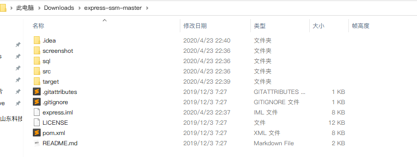
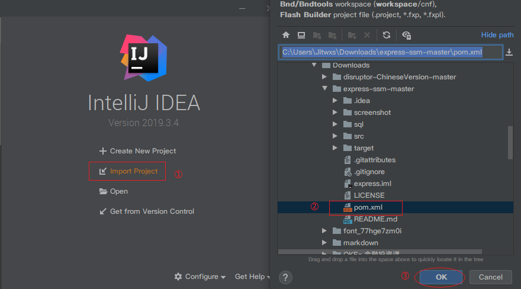
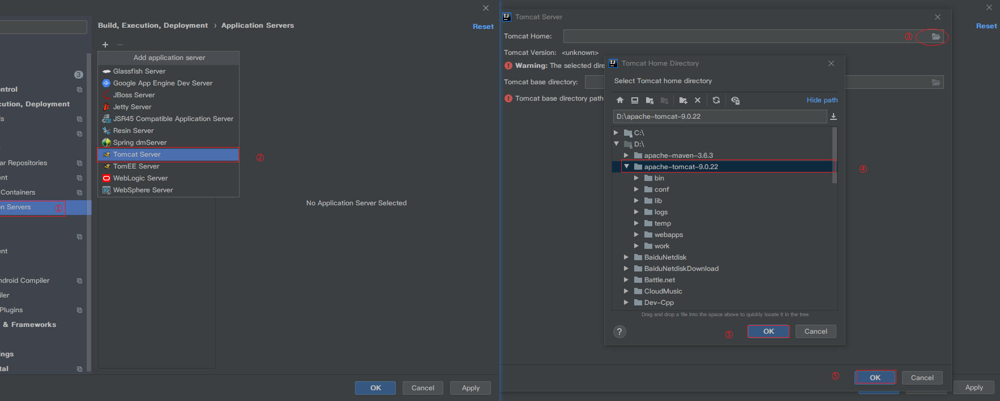
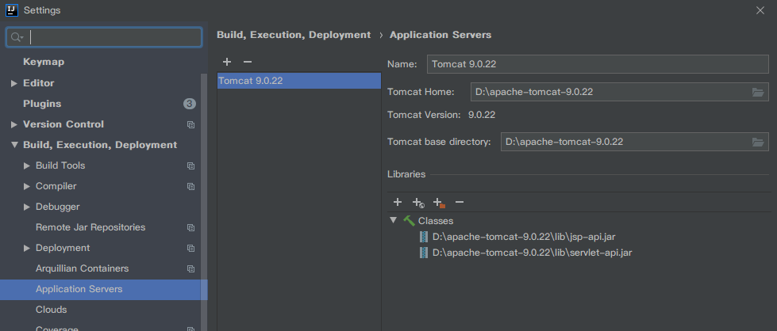
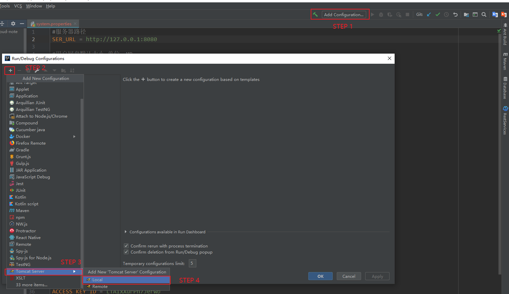
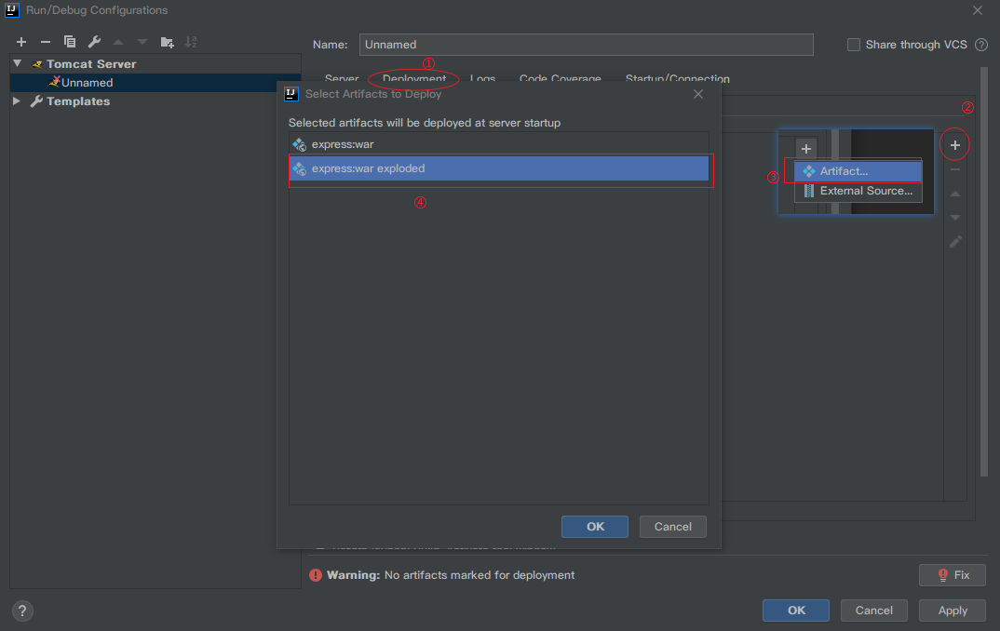
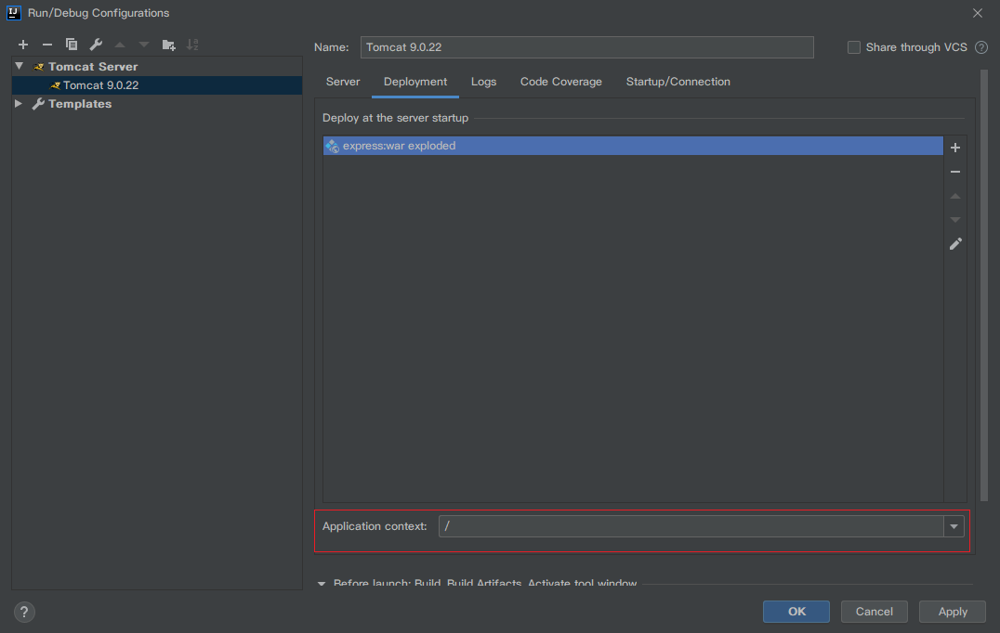
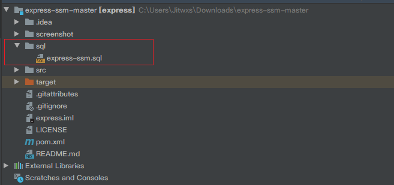
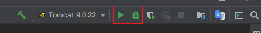

## 快递代拿系统 SSM 版

>基于 SpringBoot 全新开发的快递代拿系统已开发完毕，相关技术栈全面升级，[前往查看](<https://github.com/jitwxs/express>)。
>

### 使用技术

采用 Spring + SpringMVC + MyBatisPlus，连接池采用 Druid，安全框架使用 Shiro，前端采用 Bootstrap + layer 实现。

支付采用支付宝沙箱环境，支付APP下载链接，[点击这里](https://sandbox.alipaydev.com/user/downloadApp.htm)。

支付账号：uceskd4358@sandbox.com
登录密码、支付密码：111111

**注意：**

请务必使用以上链接下载`沙箱支付宝`，也务必使用以上账号登录。不要使用真实支付宝APP和真实支付宝账号登录。

### 默认账户

注：以下为本项目初始 SQL 中存在的用户名密码，导入 SQL 在本地运行后可以使用以下密码登录。

| 权限   | 用户名 | 密码 |
| ------ | ------ | :--- |
| 管理员 | admin  | 123  |
| 配送员 | 李四   | 123  |
| 用户名 | 小红   | 123  |

### 截图


### 如何运行

- 集成开发环境：IntelliJ IDEA
- 项目构建工具：Maven
- 数据库：MYSQL 5.7+
- JDK版本：1.8
- Tomcat版本：Tomcat8+

#### STEP1 下载并打开

点击 `Clone Or Download` 将源码下载或 Clone 到本地，目录结构如图所示。



打开 `IDEA`，选择 `Import Project`，在弹框中选中项目的 `pom.xml` 文件，点击 OK 打开项目。



#### STEP2 启动配置

在 IDEA 中，点击 `File` -> `Settings` -> `Build,Execution...` -> `Application Servers` 中添加 `Tomcat` 的路径。



添加完毕后显示如下：



点击主窗口中 `Add Configuation...`，添加 Tomcat 启动项，如图所示。



随后配置启动项，如图所示。



最后指定下项目运行的根目录，这里直接设置为 `/`。



#### STEP3 数据库配置

首先创建数据库：

```shell
CREATE DATABASE IF NOT EXISTS `express-ssm` /*!40100 DEFAULT CHARACTER SET utf8 */
```

导入项目 sql 文件夹下的 `express-ssm.sql` 文件到数据库中。



编辑项目中 `src/main/resources/cnf/mysql.properties` 文件，修改数据库连接用户名和密码信息：

```application
jdbc.driver=com.mysql.jdbc.Driver
jdbc.url=jdbc:mysql://localhost:3306/express-ssm?useUnicode=true&useSSL=false&characterEncoding=utf-8
jdbc.username=root # MYSQL 用户名
jdbc.password=root # MYSQL 密码
```

#### STEP4 运行

点击 IDEA 右上角的运行或调试按钮，待启动完毕后 IDEA 会自动打开浏览器，跳转到首页，使用默认账户即可登录。


