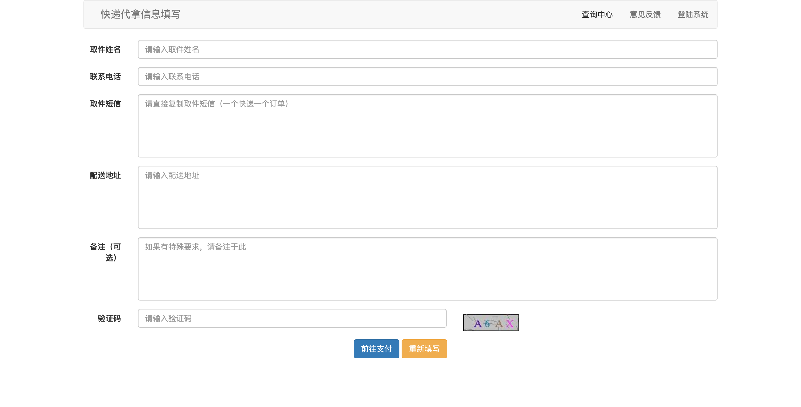
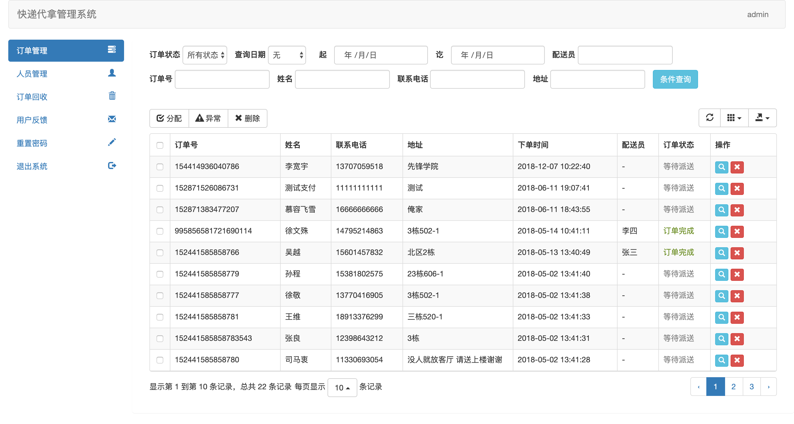

## 快递代拿系统

### 使用技术

采用 Spring + SpringMVC + MyBatisPlus，连接池采用 Druid，安全框架使用 Shiro，前端采用 Bootstrap + layer 实现。

### 运行环境

- 集成开发环境：IntelliJ IDEA

- 项目构建工具：Maven

- 数据库：Mysql

- DK版本：jdk1.8

- Tomcat版本：Tomcat8

### 在线演示

[快递代拿系统](https://express.jitwxs.cn)

| 用户名| 密码 |
| ------------- |:-------------|
| admin | 123 |
| 李四 | 123 |
| 小红 | 123 |

**请不要随意修改账户密码，如发现无法登陆，请联系我：jitwxs@foxmail.com**

### 截图

